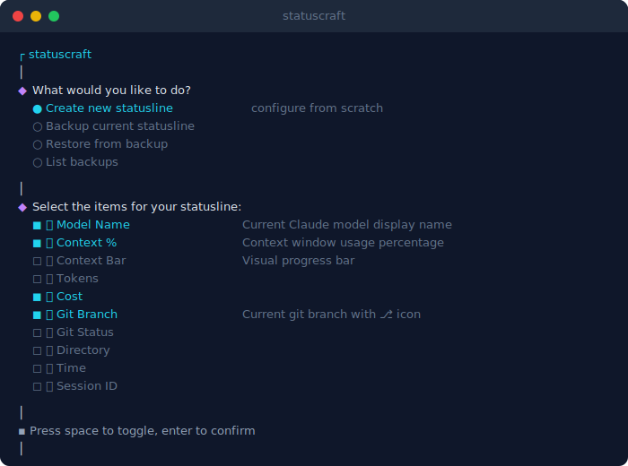
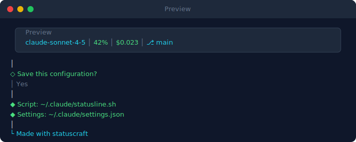
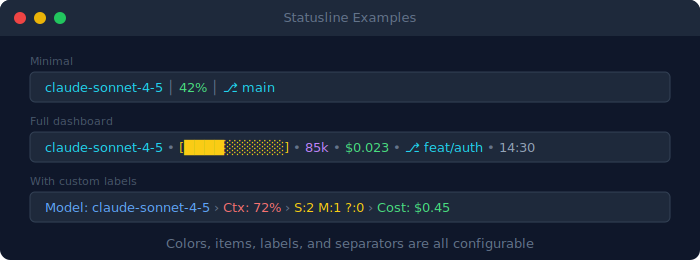

<p align="center">
  
</p>

<p align="center">
  <strong>Interactive CLI to craft your perfect Claude Code statusline.</strong><br/>
  Pick widgets, choose colors, preview in real-time, and save — all from your terminal.
</p>

<p align="center">
  <a href="#installation">Installation</a>&nbsp;&nbsp;•&nbsp;&nbsp;
  <a href="#usage">Usage</a>&nbsp;&nbsp;•&nbsp;&nbsp;
  <a href="#available-widgets">Widgets</a>&nbsp;&nbsp;•&nbsp;&nbsp;
  <a href="#how-it-works">How it works</a>
</p>

---

## Demo

<p align="center">
  
</p>

<p align="center">
  
</p>

## Statusline Examples

<p align="center">
  
</p>

## Installation

**Requirements:** Node.js >= 18 and [`jq`](https://jqlang.github.io/jq/) (used by the generated bash script).

```bash
# macOS
brew install jq

# Ubuntu / Debian
sudo apt install jq
```

### Quick start

```bash
npx statuscraft
```

### From source

```bash
git clone https://github.com/israel-gs/statuscraft-cli.git
cd statuscraft-cli
npm install
node index.js
```

### Global install

```bash
npm install -g .
statuscraft
```

## Usage

```bash
statuscraft
```

The CLI walks you through 6 steps:

1. **Choose an action** — create, backup, restore, or list backups
2. **Select widgets** — pick items with a live preview that updates as you toggle each one
3. **Configure each widget** — color, label, display mode, auto-color — preview updates as you navigate options
4. **Set display order** — use `↑`/`↓` to navigate, `Space` to grab & drag an item, preview updates live
5. **Pick a separator** — `│` `•` `›` `|` `—` `::` or double space — preview updates as you choose
6. **Preview & save** — confirm the final statusline before writing files

The tool generates `~/.claude/statusline.sh` and updates `~/.claude/settings.json` automatically. Restart Claude Code to see the changes.

## Available Widgets

| Widget | Description | Example output |
|--------|-------------|----------------|
| **Model Name** | Current Claude model | `claude-sonnet-4-5` |
| **Context %** | Context window usage | `42%` |
| **Context Bar** | Visual progress bar | `[████░░░░░░]` |
| **Tokens** | Total input tokens | `85k` |
| **Cost** | Session cost in USD | `$0.023` |
| **Git Branch** | Current branch | `⎇ main` |
| **Git Status** | Staged / Modified / Untracked | `S:2 M:1 ?:0` |
| **Directory** | Working directory | `my-project` |
| **Time** | Current time | `14:30` |
| **Session ID** | First 8 chars of session | `a1b2c3d4` |

### Auto-color

**Context %** and **Context Bar** support automatic color coding based on usage:

```
 < 40%  → green
 < 70%  → yellow
 >= 70% → red
```

### Display modes

| Widget | Modes |
|--------|-------|
| **Directory** | `basename` · `~/path` · full path |
| **Time** | 24h · 12h · with seconds |

### Colors

12 ANSI colors available for every widget:

`cyan` · `green` · `yellow` · `red` · `blue` · `magenta` · `white` · `gray` · `bright red` · `bright green` · `bright yellow` · `bright blue` · `bright magenta` · `bright cyan`

## Backups

statuscraft can save and restore your statusline configurations:

- **Backup** — saves a copy of your current `statusline.sh` with a name and timestamp
- **Restore** — pick from saved backups and overwrite the current script
- **List** — view all saved backups

Backups are stored in `~/.claude/statuscraft-backups/`.

## How it Works

Claude Code sends JSON via stdin to the statusline script:

```json
{
  "model": { "display_name": "claude-sonnet-4-5" },
  "context_window": { "used_percentage": 42.5 },
  "token_usage": { "total_input_tokens": 85000 },
  "cost_usd": 0.023,
  "session_id": "a1b2c3d4-e5f6-...",
  "workspace": { "current_dir": "/Users/you/projects/app" }
}
```

The generated bash script parses this with `jq`, formats each selected widget with ANSI colors, and outputs a single line that Claude Code renders as its statusline.

```
┌─────────────────────────────────────────────────────────┐
│  Claude Code sends JSON  →  statusline.sh  →  output    │
│                                                         │
│  { "model": ... }        →  jq + bash      →  colored   │
│                              formatting        string    │
└─────────────────────────────────────────────────────────┘
```

## License

MIT
